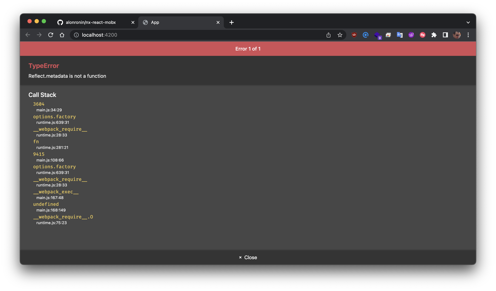

# Nx React Mobx + Typescript

> Adding support for Mobx to Nx React + Typescript

## Adding a new app to the workspace

```bash
$ nx @nrwl/react:app app
```

## Adding Mobx

```bash
$ yarn add mobx mobx-react-lite
```

## Create Mobx Store

```ts
class Store {
  @observable
  count = 0;

  @computed
  get double() {
    return this.count * 2;
  }

  constructor() {
    makeObservable(this);
  }
}
```

## Using Store in App Component

```typescript jsx
const store = new Store();

export function App() {
  return (
    <>
      <p>
        <label>Count:</label> {store.count}
      </p>
      <p>
        <label>Count Double:</label> {store.double}
      </p>
      <button onClick={() => store.count++}>Count Up</button>
    </>
  );
}
```

## Reflect.metadata Errpr

The above code will throw an error:



# Fixing Reflect.metadata Error

## Add reflect-metadata to package.json

```bash
$ yarn add -D reflect-metadata
```

## Add reflect-metadata to [polyfills.ts](./apps/app/src/polyfills.ts)

```typescript
/**
 * Polyfill stable language features. These imports will be optimized by `@babel/preset-env`.
 *
 * See: https://github.com/zloirock/core-js#babel
 */
import 'core-js/stable';
import 'regenerator-runtime/runtime';
import 'reflect-metadata';
```
